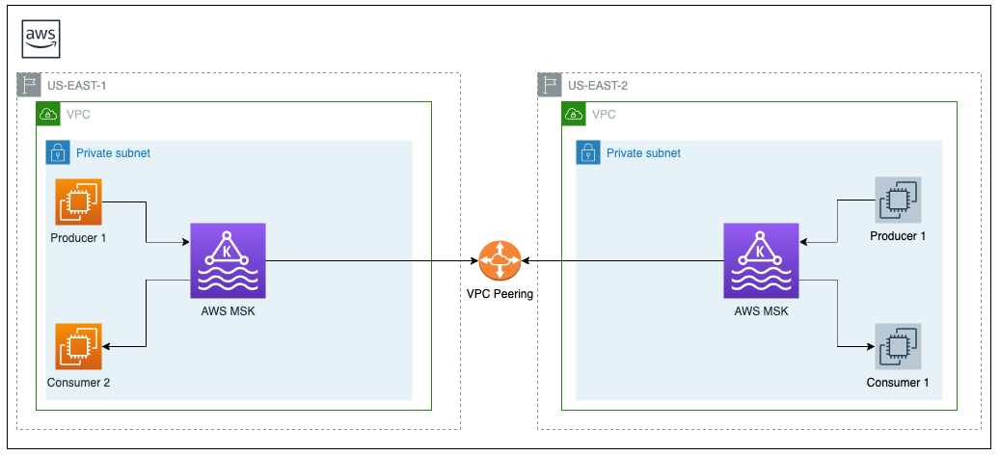

# Setting up Primary and Secondary AWS MSK Clusters

This document provides a step-by-step guidance on how to create and configure AWS MSK clusters in two different regions.



On this page

<!-- @import "[TOC]" {cmd="toc" depthFrom=2 depthTo=6 orderedList=false} -->

<!-- code_chunk_output -->

- [Before You Begin](#before-you-begin)
- [Setting up the Primary MSK Cluster](#setting-up-the-primary-msk-cluster)
  - [Creating the MSK Cluster](#creating-the-msk-cluster)
    - [Prerequisite](#prerequisite)
    - [Provision MSK Cluster](#provision-msk-cluster)
  - [Provision EC2 Client Machine](#provision-ec2-client-machine)
  - [Configure EC2 Client Machine](#configure-ec2-client-machine)
  - [Configure VPC SG Inbound Rules](#configure-vpc-sg-inbound-rules)
  - [Setting up SASL SCRAM Authentication](#setting-up-sasl-scram-authentication)
- [Setting up the Secondary MSK Cluster](#setting-up-the-secondary-msk-cluster)
- [Connecting the Primary and Secondary AWS Regions](#connecting-the-primary-and-secondary-aws-regions)
- [Next](#next)
- [Resources](#resources)

<!-- /code_chunk_output -->
## Before You Begin


* Configure your aws-cli with an IAM user having *Programmatic access* enabled. This user must have appropriate rights to manage the required services. 


    For the purpose of this POC, you can assign your IAM user with the *PowerUserAccess* policy. 

    > **_NOTE:_**  The PowerUserAccess policy will allow  can create and configure resources and services that support AWS aware application development.

* Create a new IAM Role ```MSK_EC2_ROLE```. Assign the *PowerUserAccess* policy to this role


## Setting up the Primary MSK Cluster

> **_NOTE:_**  Most of these steps are possible using the AWS Web Console. It's not mandatory to use the aws-cli for provisioning these services.

### Creating the MSK Cluster
Refer the getting started guide to set up AWS MSK cluster in the selected region 
https://docs.aws.amazon.com/msk/latest/developerguide/getting-started.html

#### Prerequisite
* Create a new VPC using the VPC Wizard and selecting the *VPC with a Single Public Subnet* option
* Add additional subnets (minimum 3 az's) for other availability zones in this VPC. Refer the getting started guide for this process.
* Make a note of the VPC ID, VPC CIDR range, and the associated default Security Group (SG) ID of the VPC

#### Provision MSK Cluster
Choose *Custom Create* option instead of *Quick Create* while creating the MSK cluster. Custom Create option will allow more control on the configurations.
* Select the appropriate VPC, Availability Zones and Security Group as created in the prerequisite step
* Under the Access control method section, select the Access control method as *SASL/SCRAM authentication*
* Under the Monitoring section, in the *Amazon CloudWatch metrics for this cluster* subsection, select *Enhanced partition-level monitoring*
* Under the Open monitoring with Prometheus, check the *Enable open monitoring with Prometheus* to enable prometheus
* Leave rest of the settings on the page as is and click *Create Cluster*

### Provision EC2 Client Machine
Follow the steps as listed here for provisioning an EC2 instance
https://docs.aws.amazon.com/efs/latest/ug/gs-step-one-create-ec2-resources.html

While following the EC2 instance creation steps make sure to incorporate the below three instructions 
* Select the VPC and one of the Az as created in the prerequisite section
* Assign the EC2 instance with ```MSK_EC2_ROLE``` IAM role as created above
* Create a new security group for this VPC and name it *msk_client_sg*

### Configure EC2 Client Machine
Once provisioned, follow the below steps: 
* SSH into the instance
* Install Java 8 by running

    ```sudo yum install java-1.8.0```
* Download and extract Apache Kafka 2.7.1 binaries 
    ```
    wget https://www.apache.org/dyn/closer.cgi?path=/kafka/2.7.1/kafka_2.13-2.7.1.tgz
    tar -xzf kafka_2.13-2.7.1.tgz
    rm kafka_2.13-2.7.1.tgz
    ```

### Configure VPC SG Inbound Rules
Add an inbound rules to the VPC default SG to allow *All traffic*  from the *msk_client_sg* security group.

Refer this link for steps: https://docs.aws.amazon.com/vpc/latest/userguide/VPC_SecurityGroups.html

### Setting up SASL SCRAM Authentication
* Create a new KMS symmetric CMKs following the steps as documented here:
https://docs.aws.amazon.com/kms/latest/developerguide/create-keys.html#create-symmetric-cmk
* Give your IAM user access to manage this key
* Follow this link which describes the steps to configure SASL/SCRAM (Simple Authentication and Security Layer/ Salted Challenge Response Mechanism) authentication on AWS MSK
  https://docs.aws.amazon.com/msk/latest/developerguide/msk-password.html
    
> **_NOTE:_**  Use the KMS key you created above and not the DefaultEncryptionKey for encrypting the AmazonMSK_** secret
  
* On the same link, the section *Connecting to your cluster with a username and password* describes the steps to authenticate your client and connect to MSK cluster for performing all kafka operations

<br />

## Setting up the Secondary MSK Cluster
All the steps as mentioned in the *Setting up the Primary MSK Cluster* section will also apply while creating a secondary MSK cluster.

Please review the below instructions before starting to provision the secondary MSK cluster:
* Its assumed that both the clusters will be in the same AWS account but in different regions
* The CIDR range of the VPC housing the MSK clusters in both the regions must not overlap with each other otherwise VPC peering will not work as needed later in this section 
  
    e.g. Primary region CIDR: 10.0.0.0/16 and Secondary region CIDR: 172.31.0.0/16  

<br />

## Connecting the Primary and Secondary AWS Regions
In this section we will be connecting the primary and secondary AWS regions to enable communication between them.

* Follow the instructions on the link below to set up VPC peering between the primary and secondary MSK cluster VPC's  
https://docs.aws.amazon.com/vpc/latest/peering/create-vpc-peering-connection.html#create-vpc-peering-connection-local

* Add a new inbound rule to the primary cluster VPC's default SG to allow *All traffic* from the CIDR range of the secondary cluster VPC's
* Add a new inbound rule to the secondary cluster VPC's default SG to allow *All traffic* from the CIDR range of the primary cluster VPC's
    
    Refer this link for instructions: https://docs.aws.amazon.com/vpc/latest/userguide/VPC_SecurityGroups.html

## Next
[Setting up MirrorMaker2 Geo-Replication](2_Setting_Up_MirrorMaker2.md)

## Resources
* [Useful Kafka Commands](Useful_Kafka_Commands.md)
* [MSK Developer Guide](https://docs.amazonaws.cn/en_us/msk/latest/developerguide/MSKDevGuide.pdf)

