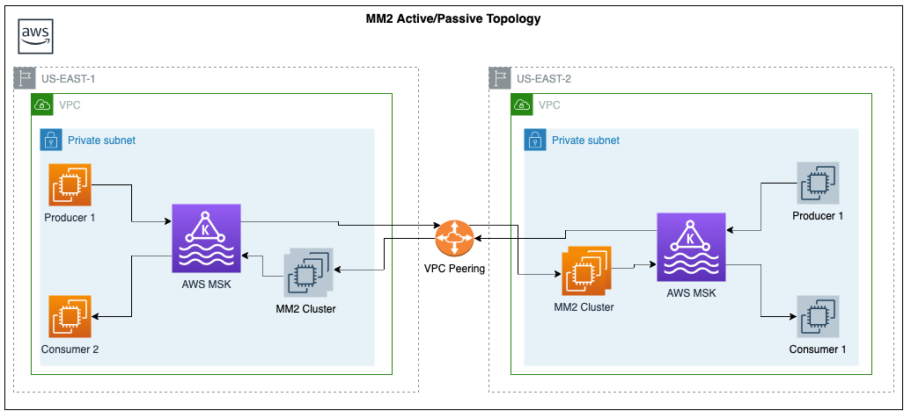
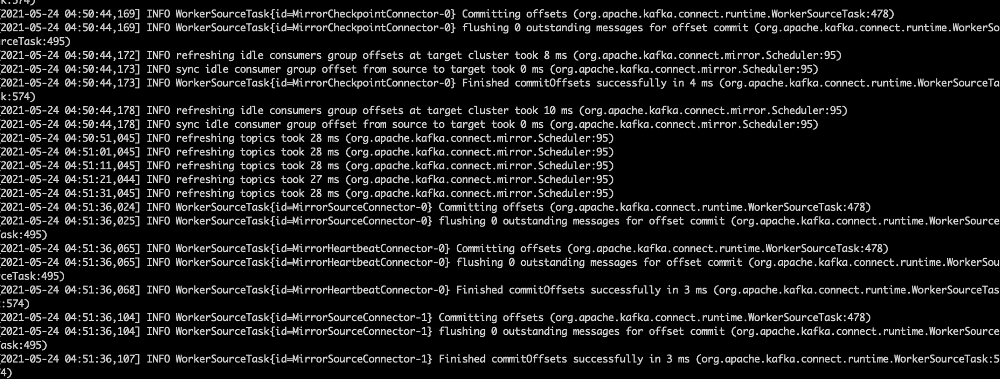

# Setting up MirrorMaker2 Geo-Replication
Follow the instructions to set up MM2 replication between the primary and secondary AWS MSK clusters.

The instructions provide guidance to set up the active-passive MM2 topology where the data from the primary clusters gets replicated into the secondary cluster.



However, this setup can be easily extended to achieve active-active MM2 replication topology as well.

> **_NOTE:_** Apache Kafka version 2.7 and above have incorporated the automated consumer offset sync functionality.  
> Any version below 2.7 would result into not replicating the consumer offsets across clusters. 

On this page

<!-- @import "[TOC]" {cmd="toc" depthFrom=2 depthTo=6 orderedList=false} -->

<!-- code_chunk_output -->

  - [Provision MM2 EC2 Instance](#provision-mm2-ec2-instance)
  - [Configure VPC SG Inbound Rules](#configure-vpc-sg-inbound-rules)
  - [Configure MM2 EC2 Instance](#configure-mm2-ec2-instance)
  - [Start MM2 Replication](#start-mm2-replication)
- [Next](#next)
- [Resources](#resources)

<!-- /code_chunk_output -->

### Provision MM2 EC2 Instance
Following the principle of remote consume and local produce, we will provision an EC2 instance in the secondary AWS region.
Follow the steps as listed here for provisioning an EC2 instance:

https://docs.aws.amazon.com/efs/latest/ug/gs-step-one-create-ec2-resources.html

While following the EC2 instance creation steps make sure to incorporate the below three instructions
* Select the secondary regions MSK VPC and one of the Az
* Assign the EC2 instance with ```MSK_EC2_ROLE``` IAM role as created before
* Create a new security group for this VPC instead and name it *mm2-sg* 

### Configure VPC SG Inbound Rules
Add an inbound rules to the secondary clusters VPC default SG to allow *All traffic* from the *mm2-sg* security group.

### Configure MM2 EC2 Instance
Once provisioned, follow the below steps:
* SSH into the instance
* Install Java 8 by running

  ```shell
  sudo yum install java-1.8.0
  ```

* Download and extract Apache Kafka 2.7.1 binaries
    ```shell
    wget https://www.apache.org/dyn/closer.cgi?path=/kafka/2.7.1/kafka_2.13-2.7.1.tgz
    tar -xzf kafka_2.13-2.7.1.tgz
    rm kafka_2.13-2.7.1.tgz
    ```
* Create a folder named /tmp on the client machine. Then, go to the bin folder of the Apache Kafka installation and run the following command, replacing JDKFolder with the name of your JDK folder.
  ```shell
    cp /usr/lib/jvm/<JDKFolder>/jre/lib/security/cacerts /tmp/kafka.client.truststore.jks
  ```
  e.g.
  ```shell
  cp /usr/java/jdk1.8.0_141/jre/lib/security/cacerts /tmp/kafka.client.truststore.jks
  ```
* CD into kafka_2.13-2.7.1 directory
* Create a new file ```mm2.properties``` inside the kafka_2.13-2.7.1 directory
  
    ```shell
    vim mm2.properties
    ```
    
* Update the contents of the file as shown below after replacing appropriate values for sections indicated with ```#__#```
    ```shell
    # Kafka datacenters.
    clusters = source, target
    source.bootstrap.servers = #_primary MSK clusters broker addresses_#
    target.bootstrap.servers = #_secondary MSK clusters broker addresses_#
    
    # Source and target clusters configurations.
    source.config.storage.replication.factor = 3
    target.config.storage.replication.factor = 3
    
    source.offset.storage.replication.factor = 3
    target.offset.storage.replication.factor = 3
    
    source.status.storage.replication.factor = 3
    target.status.storage.replication.factor = 3
    
    # Enable the MM2 flow
    source->target.enabled = true
    # set this to true to enable bidirectional replication 
    target->source.enabled = false 
    
    # Authentication settings for source MSK
    source.security.protocol=SASL_SSL
    source.sasl.mechanism=SCRAM-SHA-512
    source.ssl.truststore.location=/tmp/kafka.client.truststore.jks
    source.sasl.jaas.config=org.apache.kafka.common.security.scram.ScramLoginModule required \
      username="#_USER_NAME_USED_OF_SASL_AUTH_#" \
      password="#_PWD_USED_OF_SASL_AUTH_#";
    
    
    # Authentication settings for target MSK
    target.security.protocol=SASL_SSL
    target.sasl.mechanism=SCRAM-SHA-512
    target.ssl.truststore.location=/tmp/kafka.client.truststore.jks
    target.sasl.jaas.config=org.apache.kafka.common.security.scram.ScramLoginModule required \
      username="#_USER_NAME_USED_OF_SASL_AUTH_#" \
      password="#_PWD_USED_OF_SASL_AUTH_#";
    
    # Mirror maker configurations
    offset-syncs.topic.replication.factor = 3
    heartbeats.topic.replication.factor = 3
    checkpoints.topic.replication.factor = 3
    
    # all topics and all consumer groups
    topics = .*
    groups = .*
    
    topics.blacklist = .*[\-\.]internal, .*\.replica, __consumer_offsets
    groups.blacklist = console-consumer-.*, connect-.*, __.*
    
    # number of MM2 tasks to run on this instance
    tasks.max = 2
    
    replication.factor = 3
    refresh.topics.enabled = true
    sync.topic.configs.enabled = true
    refresh.topics.interval.seconds = 10
    
    # enable consumer offsets synchronisation
    source->target.sync.group.offsets.enabled = true
    # target->source.sync.group.offsets.enabled = true
    
    # Enable heartbeats and checkpoints.
    source->target.emit.heartbeats.enabled = true 
    source->target.emit.checkpoints.enabled = true 
    
    # target->source.emit.heartbeats.enabled = true 
    # target->source.emit.checkpoints.enabled = true 
    
    ```
Refer this link for more MM2 configurations and their description
https://kafka.apache.org/documentation/#georeplication-mirrormaker


### Start MM2 Replication
CD into kafka_2.13-2.7.1 directory if not already and run the following command to start replication
```shell
./bin/connect-mirror-maker.sh mm2.properties
```
If everything is correctly configured then you should see a similar output on the console


## Next
[Setting up Prometheus Metric and Grafana Servers](3_Setting_Up_Prometheus.md)

## Resources
* [Useful Kafka Commands](Useful_Kafka_Commands.md)
* [Kafka 2.7.0 RELEASE_NOTES](https://downloads.apache.org/kafka/2.7.0/RELEASE_NOTES.html)
* [KIP-382: MirrorMaker 2.0](https://cwiki.apache.org/confluence/display/KAFKA/KIP-382%3A+MirrorMaker+2.0)
* [MM2 Geo-Replication](https://kafka.apache.org/documentation/#georeplication)
* [Migrating Clusters Using Apache Kafka's MirrorMaker](https://docs.aws.amazon.com/msk/latest/developerguide/migration.html)
* [MM2 Setup AWS Lab](https://amazonmsk-labs.workshop.aws/en/migration/overview.html)
* [MM2 Topologies](https://www.instaclustr.com/apache-kafka-mirrormaker-2-practice/#)
* [A look inside Kafka Mirrormaker 2](https://blog.cloudera.com/a-look-inside-kafka-mirrormaker-2/)
* [kafka in multiple datacenters](https://mbukowicz.github.io/kafka/2020/08/31/kafka-in-multiple-datacenters.html)
