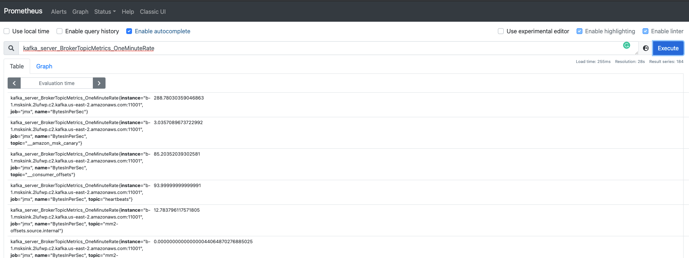
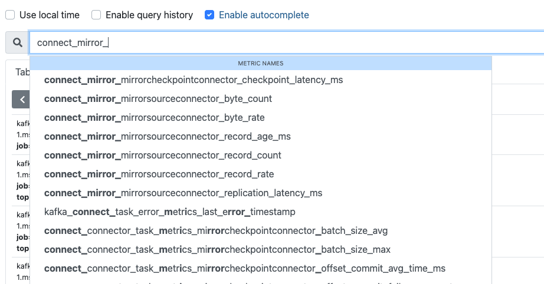
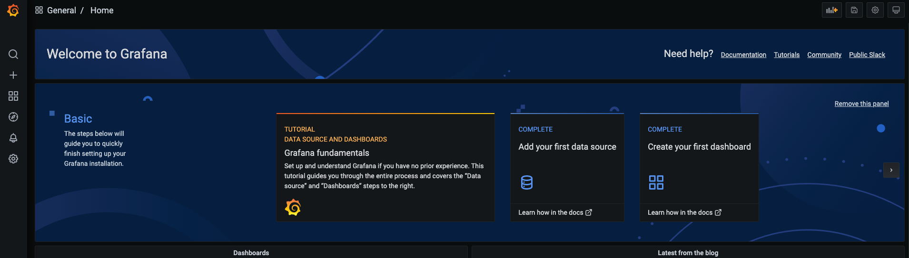

# Setting up Prometheus Metric and Grafana Servers
This section focuses on how to set up Prometheus and Grafana for capturing MSK and MM2 metrics.

On this page
<!-- @import "[TOC]" {cmd="toc" depthFrom=2 depthTo=6 orderedList=false} -->

<!-- code_chunk_output -->

- [Enable JMX Metrics for MM2 Processes](#enable-jmx-metrics-for-mm2-processes)
- [Enable Prometheus Monitoring for MSK](#enable-prometheus-monitoring-for-msk)
  - [Provision Prometheus EC2 Instance](#provision-prometheus-ec2-instance)
  - [Configure VPC SG Inbound Rules to Enable Prometheus EC2 Access](#configure-vpc-sg-inbound-rules-to-enable-prometheus-ec2-access)
  - [Configuring Prometheus Host](#configuring-prometheus-host)
- [Configure Grafana on Prometheus Host](#configure-grafana-on-prometheus-host)
- [Configure Prometheus VPC SG Inbound Rules](#configure-prometheus-vpc-sg-inbound-rules)
- [Create Prometheus Data Source for Grafana](#create-prometheus-data-source-for-grafana)
- [Next](#next)
- [Resources](#resources)

<!-- /code_chunk_output -->
## Enable JMX Metrics for MM2 Processes
Follow the below instructions to enable monitoring MM2 replication
* SSH into the MM2 instance
* Stop the MM2 process in case they are running
* CD into kafka_2.13-2.7.1 directory if not already
* Download the prometheus JMX exporter JAR file

  ```shell
  wget https://repo1.maven.org/maven2/io/prometheus/jmx/jmx_prometheus_javaagent/0.15.0/jmx_prometheus_javaagent-0.15.0.jar
  ```
* Create a new file ```MM2-JMX.yaml``` inside the kafka_2.13-2.7.1 directory

  ```shell
  vim MM2-JMX.yaml
  ```

* Update the contents of this file as shown below
    ```yaml
    lowercaseOutputName: true
    lowercaseOutputLabelNames: true
    rules:
      - pattern : "kafka.connect<type=connect-worker-metrics>([^:]+):"
        name: "kafka_connect_connect_worker_metrics_$1"
      - pattern : "kafka.connect<type=connect-metrics, client-id=([^:]+)><>([^:]+)"
        name: "kafka_connect_connect_metrics_$1_$2"
      # Rules below match the Kafka Connect/MirrorMaker MBeans in the jconsole order
      # Worker task states
      - pattern: kafka.connect<type=connect-worker-metrics, connector=(\w+)><>(connector-destroyed-task-count|connector-failed-task-count|connector-paused-task-count|connector-running-task-count|connector-total-task-count|connector-unassigned-task-count)
        name: connect_worker_metrics_$1_$2
      # Task metrics
      - pattern: kafka.connect<type=connector-task-metrics, connector=(\w+), task=(\d+)><>(batch-size-avg|batch-size-max|offset-commit-avg-time-ms|offset-commit-failure-percentage|offset-commit-max-time-ms|offset-commit-success-percentage|running-ratio)
        name: connect_connector_task_metrics_$1_$3
        labels:
           task: "$2"
      # Source task metrics
      - pattern: kafka.connect<type=source-task-metrics, connector=(\w+), task=(\d+)><>(source-record-active-count|source-record-poll-total|source-record-write-total)
        name: connect_source_task_metrics_$1_$3
        labels:
           task: "$2"
      # Task errors
      - pattern: kafka.connect<type=task-error-metrics, connector=(\w+), task=(\d+)><>(total-record-errors|total-record-failures|total-records-skipped|total-retries)
        name: connect_task_error_metrics_$1_$3
        labels:
          task: "$2"
      # CheckpointConnector metrics
      - pattern: kafka.connect.mirror<type=MirrorCheckpointConnector, source=(.+), target=(.+), group=(.+), topic=(.+), partition=(\d+)><>(checkpoint-latency-ms)
        name: connect_mirror_mirrorcheckpointconnector_$6
        labels:
           source: "$1"
           target: "$2"
           group: "$3"
           topic: "$4"
           partition: "$5"
      # SourceConnector metrics
      - pattern: kafka.connect.mirror<type=MirrorSourceConnector, target=(.+), topic=(.+), partition=(\d+)><>(byte-rate|byte-count|record-age-ms|record-rate|record-count|replication-latency-ms)
        name: connect_mirror_mirrorsourceconnector_$4
        labels:
           target: "$1"
           topic: "$2"
           partition: "$3"
           
      # kafka.connect:type=connector-metrics,connector="{connector}"
      - pattern: 'kafka.connect<type=connector-metrics, connector=(.+)><>status: ([a-z-]+)'
        name: kafka_connectors_status
        value: 1
        labels:
          connector: $1
          status: $2
        help: "Kafka Connect JMX metric connectors status"
        type: GAUGE
    ```
* Set the KAFKA_OPTS environment variable as shown below
    ```shell  
    export KAFKA_OPTS=-javaagent:/home/ec2-user/kafka_2.13-2.7.1/jmx_prometheus_javaagent-0.15.0.jar=8080:/home/ec2-user/kafka_2.13-2.7.1/MM2-JMX.yaml
    ```
  Make a note of the PORT used in the above command to expose the MM2 metrics over http e.g. 8080. 
  This address will be used by the prometheus instance to consume MM2 metrics.


* Start MM2 replication
    ```shell
    ./bin/connect-mirror-maker.sh mm2.properties
    ```


## Enable Prometheus Monitoring for MSK

### Provision Prometheus EC2 Instance
Follow the steps as listed here for provisioning an EC2 instance:

https://docs.aws.amazon.com/efs/latest/ug/gs-step-one-create-ec2-resources.html

While following the EC2 instance creation steps make sure to incorporate the below three instructions
* Select the secondary regions MSK VPC and one of the Az
* Assign the EC2 instance with ```MSK_EC2_ROLE``` IAM role as created before
* Create a new security group for this VPC instead and name it *prometheus-sg*

### Configure VPC SG Inbound Rules to Enable Prometheus EC2 Access
* Add an inbound rules to the secondary clusters VPC default SG to allow *All traffic* from the *prometheus-sg* security group
* Add an inbound rules to the *mm2-sg* SG to allow *All traffic* from the *prometheus-sg* security group

### Configuring Prometheus Host
* SSH into the Prometheus EC2 instance
* Verify a successful connections to MM2 metric endpoint by running the following command
  ```shell
  telnet <Private IPv4 DNS address of MM2 Instance> 8080
  ```
  or
  ```shell
  wget http://<Private IPv4 DNS address of MM2 Instance>:8080/
  ```
* Refer section ```Setting Up a Prometheus Host on an Amazon EC2 Instance``` on this link https://docs.aws.amazon.com/msk/latest/developerguide/open-monitoring.html for instructions on how to configure prometheus
* Make sure to use the below contents for the ```targets.json``` file after replacing the broker and MM2 instance addresses
    ```json
    [
      {
        "labels": {
          "job": "jmx"
        },
        "targets": [
          "broker1:11001",
          "broker2:11001",
          "broker3:11001"
        ]
      },
      {
        "labels": {
          "job": "node"
        },
        "targets": [
          "broker1:11002",
          "broker1:11002",
          "broker2:11002"
        ]
      },
      {
        "labels": {
          "job": "mm2"
        },
        "targets": [
          "<Private IPv4 DNS address of MM2 Instance>:8080"
        ]
      }
    ]
    ```

## Configure Grafana on Prometheus Host
* SSH into the Prometheus EC2 instance
* Download the Grafana Binaries
  ```shell
  wget https://dl.grafana.com/oss/release/grafana-7.5.7.linux-amd64.tar.gz
  tar -zxvf grafana-7.5.7.linux-amd64.tar.gz  
  ```
* CD into ```grafana-7.5.7.linux-amd64``` directory
* CD into ```/conf``` directory
* Edit the ```defaults.ini``` file in the editor of your choice
* Find the section ```Anonymous Auth``` in this file
* Update the ```Anonymous Auth``` section to look as shown below
  ```shell
  #################################### Anonymous Auth ######################
  [auth.anonymous]
  # enable anonymous access
  enabled = true
  
  # specify organization name that should be used for unauthenticated users
  org_name = Main Org.
  
  # specify role for unauthenticated users
  org_role = Admin
  
  # mask the Grafana version number for unauthenticated users
  hide_version = false
  ```
 > **_NOTE:_** Enabling anonymous authentication is not recommended for production usecase and is done here for demonstration/poc purpose.
  
* Save the file
* Navigate back to the root of ```grafana-7.5.7.linux-amd64``` directory
* Start the Grafana server by running
  ```shell
  ./bin/grafana-server
  ```

## Configure Prometheus VPC SG Inbound Rules
* Add an inbound rule to the *prometheus-sg* SG to allow traffic into port 9090 from your client machine's public IP address, or a restricted IP address range.
* Add an inbound rule to the *prometheus-sg* SG to allow traffic into port 3000 from your client machine's public IP address, or a restricted IP address range.

If all the configurations are done correctly then you should be able to launch the prometheus web application on your browser by typing in http://<Prometheus_EC2_Public_IPv4_DNS_Address>:9090/.

Doing a quick search on prometheus should result into Kafka metrics as shown below



Also, the MM2 metrics should start showing up as shown below



Grafana web application should be available at http://<Prometheus_EC2_Public_IPv4_DNS_Address>:3000/



## Create Prometheus Data Source for Grafana
* Launch the Grafana web application on http://<Prometheus_EC2_Public_IPv4_DNS_Address>:3000/
* On the left navigation, click gear sign and select __Data Sources__
* Click Add **data source** button
* From the available list of data sources, select **Prometheus**
* Provide a name to the data source as **Prometheus**
* Set the URL property under HTTP section to http://localhost:9090
* Click **Save & Test** button at the bottom of the page

## Next
[Setting up Grafana Dashboards](4_Setting_Up_Monitoring.md)


## Resources
* [Useful Kafka Commands](Useful_Kafka_Commands.md)
* [MM2: Monitoring Geo-Replication](https://kafka.apache.org/documentation/#georeplication-monitoring)
* [jmx_exporter repo](https://github.com/prometheus/jmx_exporter)
* [MirrorMaker2 monitoring rules](https://jbcodeforce.github.io/kp-data-replication/mm2-provisioning/)
* [Monitoring Mirror Maker and kafka connect cluster](https://jbcodeforce.github.io/kp-data-replication/monitoring/)

