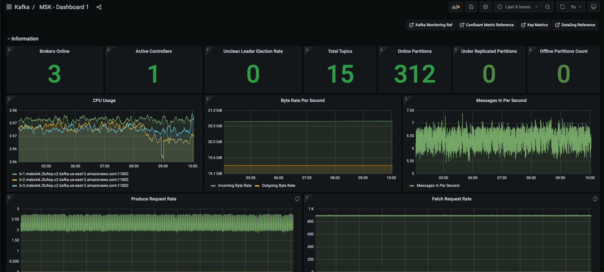
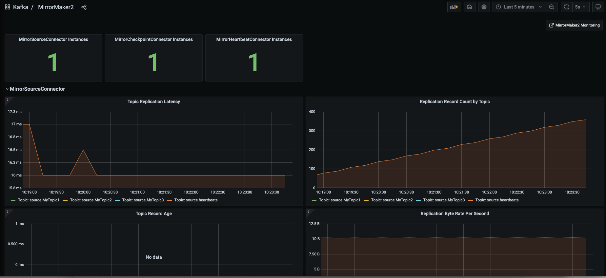

# Setting up Grafana Dashboards
This section focuses on setting Grafana dashboards for monitoring MSK and MM2 metrics.

On this page
<!-- @import "[TOC]" {cmd="toc" depthFrom=2 depthTo=6 orderedList=false} -->

<!-- code_chunk_output -->

- [Importing the MSK Dashboard](#importing-the-msk-dashboard)
- [Importing the MirrorMaker2 Dashboard](#importing-the-mirrormaker2-dashboard)
- [Resources](#resources)

<!-- /code_chunk_output -->

## Importing the MSK Dashboard
* Launch the Grafana web application on http://<Prometheus_EC2_Public_IPv4_DNS_Address>:3000/
* On the left navigation, click gear plus sign and select __Import__
* Download the [MSK Dashboard](../dashboards/MSK.json) file  to your local machine
* Click **Upload JSON** file button and browse to the downloaded file
* Click **Import** button to finish importing the dashboard
* If everything is configured correctly then you should see the dashboard as shown below
  
  
  
 

## Importing the MirrorMaker2 Dashboard
* Launch the Grafana web application on http://<Prometheus_EC2_Public_IPv4_DNS_Address>:3000/
* On the left navigation, click gear plus sign and select __Import__
* Download the [MirrorMaker2 Dashboard](../dashboards/MirrorMaker2.json) file to your local machine
* Click **Upload JSON** file button and browse to the downloaded file
* Click **Import** button to finish importing the dashboard
* If everything is configured correctly then you should see the dashboard as shown below

  

## Resources
* [Useful Kafka Commands](Useful_Kafka_Commands.md)
* [Monitoring Apache Kafka](https://kafka.apache.org/documentation/#monitoring)
* [Amazon MSK Metrics for Monitoring](https://docs.aws.amazon.com/msk/latest/developerguide/metrics-details.html)
* [Confluent: Monitoring Kafka](https://docs.confluent.io/platform/current/kafka/monitoring.html#)
* [Datadog: Key metrics for monitoring Kafka](https://www.datadoghq.com/blog/monitoring-kafka-performance-metrics/#key-metrics-for-monitoring-kafka)
* [Kafka Metrics to Monitor](https://sematext.com/blog/kafka-metrics-to-monitor/)
* [MM2: Monitoring Geo-Replication](https://kafka.apache.org/documentation/#georeplication-monitoring)

